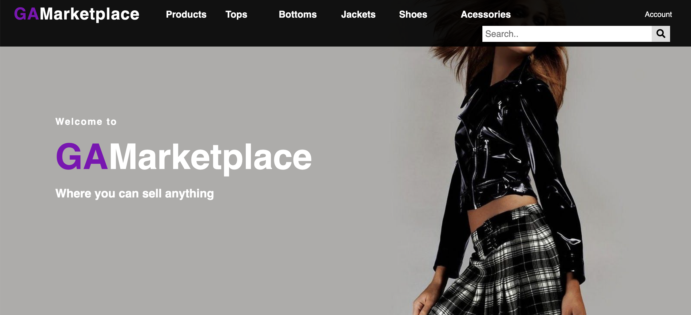
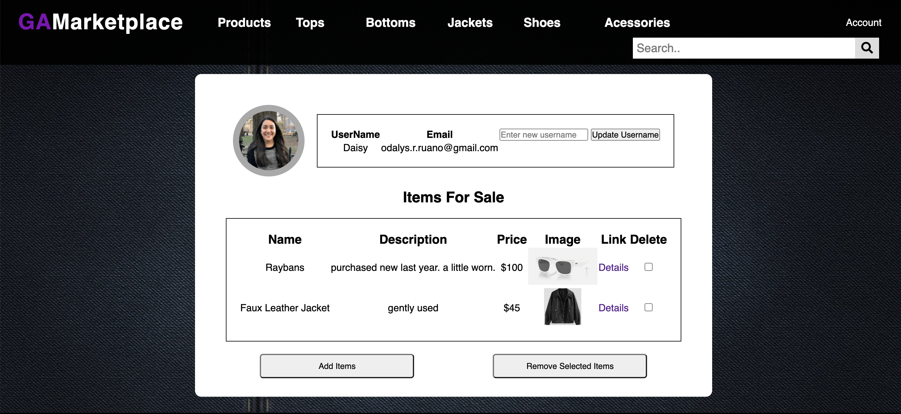
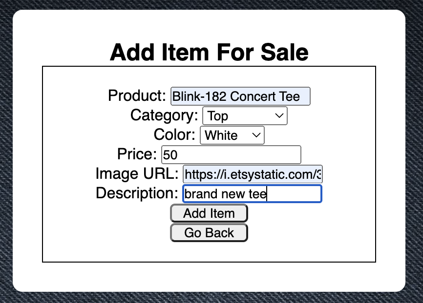
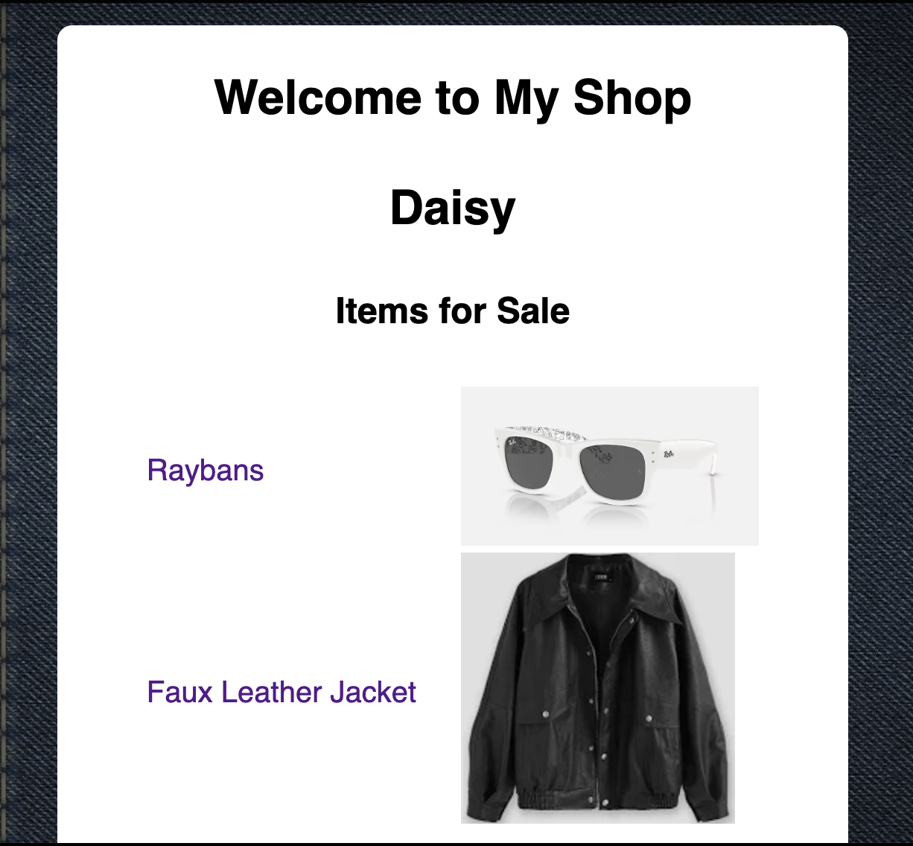
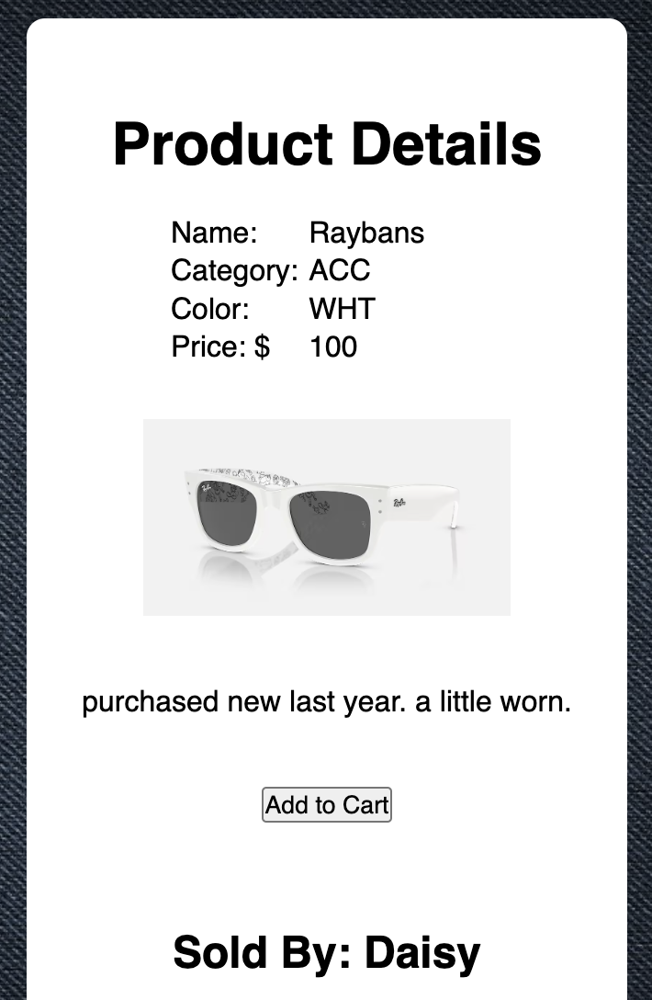
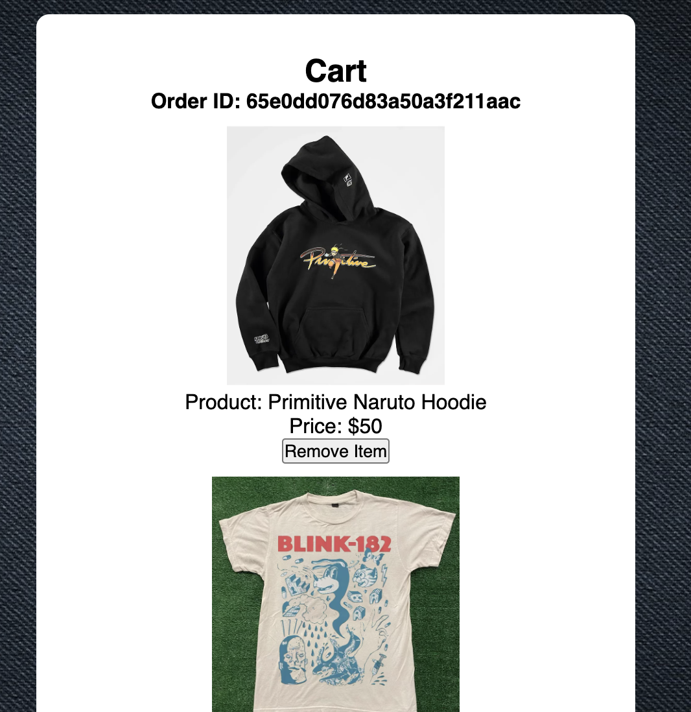
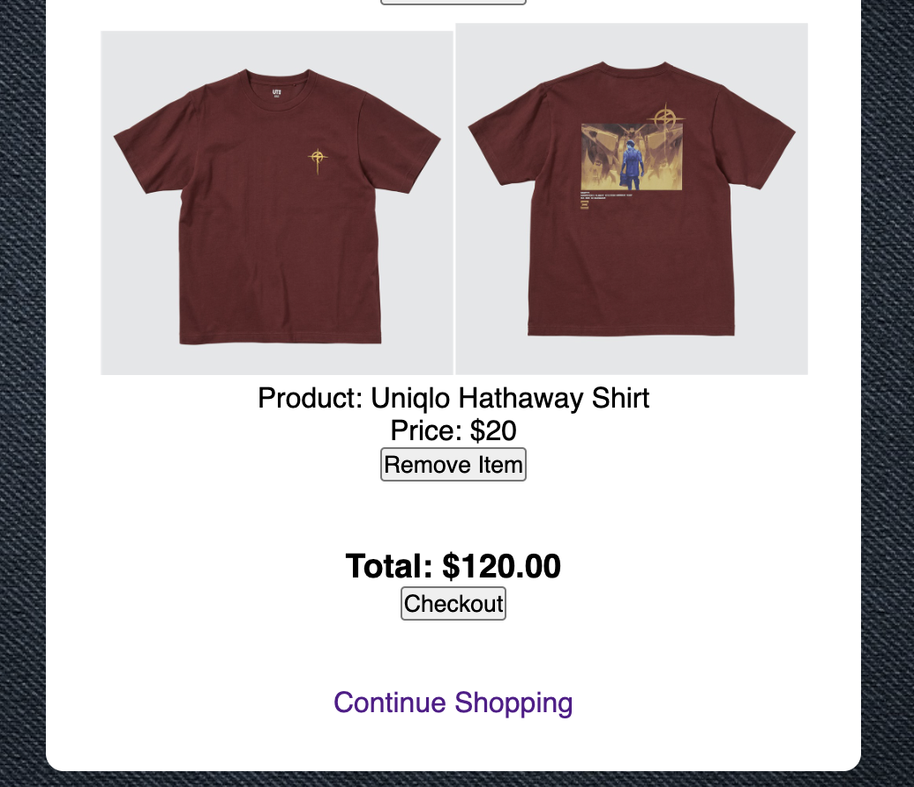

# GA Marketplace

## App Description
This app is a marketplace that allows users to buy & sell clothing online. Users can create a profile to list items to their "shop", or they can merely enjoy shopping from other seller profiles. 

## Screenshots

## Technologies Used
- Javascript
- HTML
- CSS
- EJS
- MongoDB
- Express.js
- Passport.js

## Getting Started
Link to App: https://arcane-meadow-90413-3bd59a11fb6a.herokuapp.com/

Trello Board: https://trello.com/b/NWYZg3Oq/sei-project-2

Excalidraw: https://excalidraw.com/#room=62f418438bed51eb67de,fNwEKooyDtWXnYJUS80Cig

## Next Steps
Planned future enhancements include implementing a review feature that allows buyers to leave reviews for sellers on their "shop" page. This will add a social aspect to the app. Other features may include in-app chat or message functionality to allow buyers and sellers to communicate with each other.
